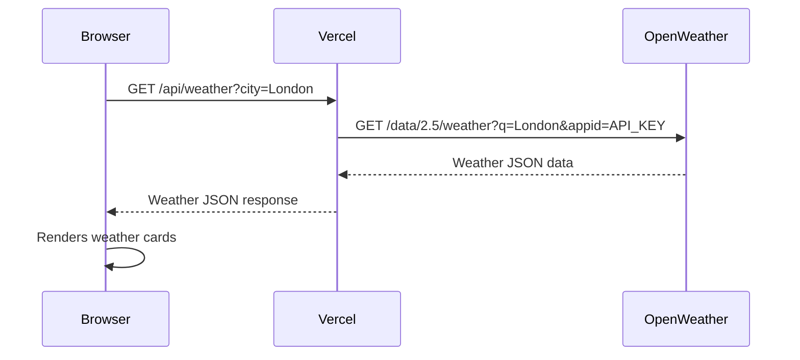

# 🌤 Weather Dashboard - API Integration MVP

A real-time weather dashboard that integrates with the **OpenWeather API**. Built with vanilla JavaScript and deployable to **Vercel** with a serverless API backend to keep your API key secure.

## 🚀 Live Demo

https://api-integration-test.vercel.app (after deployment)

## 🛠 Tech Stack

- **Vanilla JavaScript** (ES6+) - No frameworks, no build tools
- **HTML5/CSS3** - Semantic markup, responsive design, animations
- **Vercel Serverless Functions** - API proxy keeps the API key secure
- **OpenWeather API** - Free weather data provider

## 📋 Features

- Search weather by city name
- Quick-select popular cities (London, New York, Tokyo, Dubai, Karachi)
- Geolocation support (auto-detect your location)
- Real-time weather data: temperature, humidity, wind, pressure, visibility, sunrise/sunset
- Loading states and error handling
- Responsive design (mobile-friendly)

## 🔑 Getting an API Key

1. Go to [https://openweathermap.org/api](https://openweathermap.org/api)
2. Click **"Sign Up"** and create a free account
3. Once logged in, go to **"API Keys"** tab in your account dashboard
4. Copy your default API key
5. Free tier: **60 calls/minute**, **1,000,000 calls/month**

## 🖥 Local Development

1. **Clone the repo**
   ```bash
   git clone https://github.com/islahuddinn/api-integration-test.git
   cd api-integration-test
   ```

2. **Install dependencies**
   ```bash
   cd weather-app
   npm install
   ```

3. **Add your API key**
   Create a `.env` file in the `weather-app/` folder:
   ```env
   VITE_OPENWEATHER_API_KEY=your_api_key_here
   ```

4. **Run the app** (starts both API server and frontend)
   ```bash
   npm run dev:api     # Terminal 1: starts API on port 3001
   npm run dev:frontend # Terminal 2: starts frontend on port 5173
   ```
   Then open **http://localhost:5173**

## 🌐 Deploy to Vercel

### Option 1: Deploy via Vercel CLI

1. Install Vercel CLI:
   ```bash
   npm i -g vercel
   ```

2. Deploy from the `weather-app/` directory:
   ```bash
   cd weather-app
   vercel
   ```

3. When prompted, **add the environment variable**:
   - Name: `VITE_OPENWEATHER_API_KEY`
   - Value: `your_api_key_here`

4. Follow the prompts and your app will be live at a URL like `https://api-integration-test.vercel.app`

### Option 2: Deploy via Vercel Dashboard

1. Push this repo to GitHub
2. Go to [https://vercel.com/new](https://vercel.com/new)
3. Import your `api-integration-test` repository
4. Set **Root Directory** to `weather-app`
5. Under **Environment Variables**, add:
   - `VITE_OPENWEATHER_API_KEY` = `your_api_key_here`
6. Click **Deploy**

## 📁 Project Structure

```
weather-app/           ← Vercel project root
├── index.html         # Main page
├── style.css          # Styles
├── app.js             # Frontend logic
├── api/
│   ├── weather.js     # Serverless function (Vercel)
│   └── dev-server.js  # Local dev API server
├── .env               # Local environment variables (gitignored)
├── .env.example       # Environment variable template
├── vercel.json        # Vercel configuration
├── package.json       # Dependencies & scripts
├── vite.config.js     # Vite dev server config
└── README.md          # This file
```

## 🔌 How It Works



The API key stays **server-side only** - never exposed to the client.

## 🧪 Error Handling

- **404** - City not found
- **400** - Missing search parameters
- **500** - Server configuration error (missing API key)
- **Network errors** - Graceful fallback messages

## 📸 Screenshot

*(Add your screenshot here)*

---

Built with ❤️ for API integration demonstration.